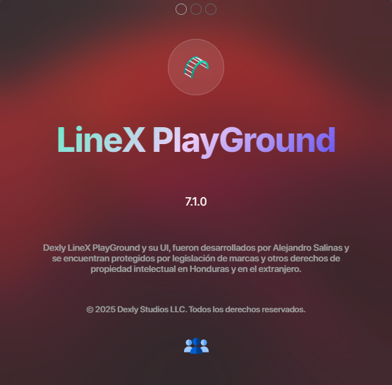

<div align=center>

  
  
</div>

<h1 align=center>LineX PlayGround</h1>
<div align=center>


<br>
<b>LineX</b> es una herramienta de consola con mejoras estéticas<br>
Este proyecto fue creado por <a href="https://instagram.com/salinxlg">Alejandro Salinas</a>.<br>
<b>LineX es compatible con Windows, Linux y MacOs</b>

<br>

</div>

<br><br>

<details>
  <summary>Capturas del Proyecto</summary>
  <div align=center>
	
  </div> 
</details><br> 

## Inicio Rápido
Descarga de los archivos
```bash
npm install dexline
```

Descarga de las dependencias de LineX

```bash

npm install

```

Iniciando LineX

```bash

npm start

```

Puedes iniciar LineX con este comando tambien:

```bash

npm run linex

```

<details>
  <summary>Estructura y distribución del proyecto</summary>


```bash
LineX/
├── assx/
│   ├── com.css/
│   │   └── com.config.css        // archivo de estilos
│   ├── com.js/
│   │   ├── com.engine.js         // archivo principal
│   │   ├── com.back.js           // archivo de Backup (vacío)
│   │   ├── com.dexkit.js         // kit de desarrollo
│   │   └── prep.dexkit.js        // iniciador del kit
│   ├── fonts/                    // fuentes
│   ├── icons/                    // iconos
│   └── img/                      // imágenes
│
├── docs/                         // capturas de pantalla
│
├── error/
│   ├── css/
│   ├── img/
│   └── index.html
│
├── public/
│   ├── about/                    // página de información del proyecto
│   ├── preload/                  // página cargador de la aplicación
│   └── index.html                 // aplicación
│
├── srx/
│   ├── backup.js                 // backup del main
│   ├── com.boot.js               // lógica de la app
│   └── com.preloader.js          // preload
│
├── com.dexly.trust.cer           // certificado de CA para confianza en Windows
├── package.json
└── package-lock.json

```

</details>


<details>
  <summary>Ver información y versión de LineX</summary>
    <br>
    Puedes ejecutar cualquiera de estos comandos para ver la versión o información de tu instalación
    <br><br>


```js

dex -v

```

```js

dex -about

```

```js

dex about

```

esto mostrará una ventana con esta información

<div align=center>

</div>
</details>

<br>


## Compilar el proyecto y distribuir
Para compilar este proyecto es necesario usar 
` electron-builder `:

``` bash
npm install electron-builder -dev
```

El package.json ya está listo para empaquetar, puedes modificar esta información:

``` json
  "build": {

    "appId": "com.dexly.linex",
    "productName": "Dexly LineX PlayGround",
    "files": [

      "srx/**/*",
      "error/**/*",
      "assx/**/*",
      "public/**/*",
      "package.json"

    ],
    "win": {

      "target": "nsis",
      "icon": "assx/img/logo.png"

    }

  },
```

Es importante mencionar que electron, y electron-builder no pueden estar dentro de ` dependencies `, deben estar dentro de ` devDependencies ` de lo contrario no podrás compilar.

Cuando todo esté listo para compilar ejecutas:

```bash

npm run dist

```

esto creará una carpeta llamada dist en la raiz del proyecto, dentro estará el instalador de tu app, y tu app descomprimida, lista para ejecutar, solo te faltará firmar el exe, para eso puedes usar mi proyecto 
[`Dexly CA`](https://github.com/salinxlg/dexlyca):

## Información de versiones del proyecto:

<details>
  <summary>Versión de Node.js</summary>
  
  <br>
  
  Use Node.js ` v24.6.0 `

</details>

<details>
  <summary>Versión de npm</summary>
  
  <br>
  
  Use npm ` v11.5.1 `

</details>

<details>
  <summary>Versión de electron</summary>
  
  <br>
  
  Use electron ` v37.1.0 `

</details>

<br>


## Información final del proyecto:

- [Alejandro Salinas](https://instagram.com/salinxlg) es el creador de este proyecto
- La versión actual de LineX es `v7.1.0`
- Puedes instalar el proyecto clonando el repositorio o con `npm install dexline`
- © 2025 Alejandro Salinas, Dexly Studios, Todos los derechos Reservados.

<br><br>
<div align=center>


</div>
